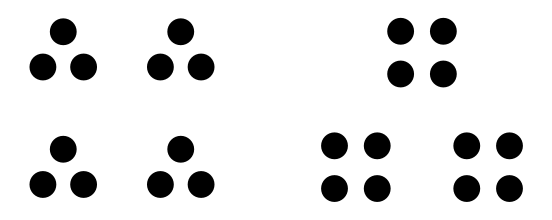

Numbers can be classified as either *composite* or *prime*. Composite numbers can be decomposed into groupings of smaller numbers. For example, one way to represent 12 is 3 times 4. We can picture this as either 4 groups of 3 or 3 groups of 4:

