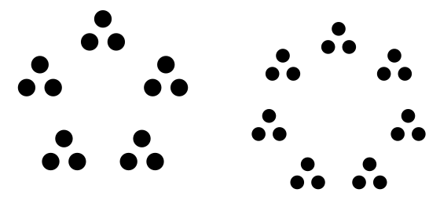

# A visual explanation of the euclidean algorithm

## Preliminaries

Numbers can be classified as either *composite* or *prime*. Prime numbers have no divisors other than 1 and themselves. Composite numbers, on the other hand, can be decomposed into groupings of smaller numbers. For example, one way to represent 12 is 3 times 4. We can picture this as either 4 groups of 3 or 3 groups of 4:

There is, however, no way to factor primes like 7 into smaller groupings. Or, if you prefer, a prime number is a collection of "groups" of 1:

In other words, the units in a composite number clump together into "families",     while in primes they're all individualists.

The main theme in this article will be these groupings of numbers.

## The algorithm
Euclid's algorithm is an algorithm for finding the greatest common divisor of two integers. Here's a description in words:

  > To find the greatest common divisor of two numbers, **a** and **b** (**a** > **b**):
  > If **a** is even divisible by **b**, the answer is **b**.
  > Otherwise, if **r** is the remainder of **a** / **b**, then **r** is not zero, so the answer is the greatest common divisor of **b** and **r**

And one in pseudocode:

    function gcd(a, b):
        if ( a < b ):
            return gcd(b, a)

        while (b does not divide a):
            r = a mod b
            a = b
            b = r
        
        return b

Here `mod` means the result of taking **a** modulo **b**, i.e. finding the remainder after dividing **a** by **b**.

(Notice that the english version used a *recursive* formulation, while the pseudocode version was *imperative*. There is no practical difference.)

The above isn't very intuitive to me, probably because I'm not very smart. So I made some pictures to help me understand.

## In pictures

Let's start with a simple example, 21 and 15. We can visualize 21 as seven groups of 3, and 15 as five groups of 3:

The euclidean algorithm says this: if we take as many 15's out of 21 as is possible, the remainder will be some number of groups of 3.

Well golly, it seems to have worked. The right side has seven groups of 3, the left side has five groups of 3. When we take five groups away from 7 groups, we're left with two groups of 3, commonly known as 6.

With a remainder of 6, the algorithm then moves into the next step of finding the GCD of 15 and 6:

Instead of thinking about division and remainders, we can also think about repeatedly subtracting 6 from 15. Each time we take two groups of 3 away from 15. The steps have been marked as different colors in the above image.

After taking two groups of 3 from 15, then taking two more groups of 3 (i.e taking two groups of 3 *twice*), we are left with a single group of 3 on the left side.

This is where the algorithm halts. On the left side we have a single group of 3, so we can subtract it from the right side until there's nothing left. In other words, 6 is divisible by 3, so 3 is the greatest common divider of 21 and 15 (the two numbers we started with, if you recall).

## A recap and an example with coprimes
Notice that all of the numbers that the algorithm handled were groups of 3. We started out with groups of three and subtracted groups of 3 from one of the sides, each time resulting in another number which consisted of groups of 3. The end result was a single group of 3, which was how we knew the algorithm was done (and that the answer was "3").

What happens when the groups that make up number **a** and number **b** are *incompatible*? Take, for example, 10 and 21:

We need to take two 10's away from the right side, but in the process of doing that it is necessary to break apart one of the groups of 3 that make up 21. In fact, we aren't subtracting groups of 3 from 21 at all, but are instead just taking 10 dots away from the right side. How we group them doesn't appear to matter.

One might allege: perhaps this was just an incidental feature of the way we *arbitrarily chose* to group up the units in 21. Perhaps if we instead represent 21 as 3 groups of 7, then the euclidean algorithm won't break a group apart:

Nope, no such luck. 

Okay, that proves it in the case of the pair (21, 7), but do we have a generic argument for *any* pair of numbers?

One thing to notice is that, so far, when we execute this algorithm for numbers with incompatible groups, we are left with a single dot at the end. The situation is reminiscent of applying the algorithm to two prime numbers (which, if you recall, are numbers that cannot be grouped into smaller families of dots). Consider the example of 7 and 17:

This result makes perfect sense if you remember that prime numbers can be thought of as being composed of "families" of one dot. Each time we substract off some number of families of one dot, and the algorithm will terminate when we have only one such family left. That is, it terminates with a single dot, indicating that the greatest common divider of two prime numbers is 1.

However, our previous case of 10 and 21 resulted in a GCD of 1 despite neither 10 nor 21 being prime. Why?

As we alluded to above, 10 and 21 are said to be **coprime** because their groups are "incompatible". What it really means is that 10 and 21 are a pair of numbers with gcd = 1, but intuitively, for our purposes, we can think of it like this: *even though the numbers themselves can be grouped up into smaller families, these families are irrelevant once we start dividing/subtracting*. For 10 and 21, we might as well have arranged the dots in one big circle (like we do for primes) and started subtracting, because there is no way that we can group either number into smaller families that will tell us any useful information about the division of 21 by 10.

## What do I do with these words, if anything?
*This is not part of the article. These are paragraphs I wrote and then decided then didn't fit into the above flow, but I wasn't sure that they were useless enough to be deleted.*

So we're done, right? We've just explained why the euclidean algorithm furnishes the GCD, call it **g**, of two numbers, **a** and **b**: it's because both of the numbers can be represented as multiples of **g**, so that **a** = **j** * **g** and **b** = **k** * **g** for some numbers **j** and **k**. So when you subtract **k** **g**'s from **j** **g**'s, you're left with (**j** - **k**) **g**'s. **So every remainder is still some number of groups of g. We never break a group up.**

So, why does it work? The standard response is that algorithm utilizes a *loop invariant*: every common divisor of **a** and **b** is also a divisor of **b** and **r**. Since the set of divisors stays constant for each iteration of the loop, and since we reduce numbers until we can't do it any more (notice that if we did it one more step, **r** would be equal to 0 since **b** divides **a** after the last step in our algorithm above.) To hammer that point home: every common divisor divides **r**, and therefore divides **b** after each step, including the **biggest** common divisor. If we stop when **b** divides **a**, then we must be stopping when **b** is the greatest common divisor (because we know, at the stopping point, that at least **b** divides **a**, so the GCD must be at least as big as **b**. But we know it can't be bigger than **b**, because the GCD also divides **b**).
