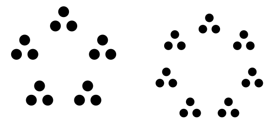

# A visual explanation of the euclidean algorithm

## Preliminaries

Numbers can be classified as either *composite* or *prime*. Prime numbers have no divisors other than 1 and themselves. Composite numbers, on the other hand, can be decomposed into groupings of smaller numbers. For example, one way to represent 12 is 3 times 4. We can picture this as either 4 groups of 3 or 3 groups of 4:

There is, however, no way to factor primes like 7 into smaller groupings:

## The algorithm
Euclid's algorithm is an algorithm for finding the greatest common divisor of two integers. Here's a description in words:

  > To find the greatest common divisor of two numbers, **a** and **b** (**a** > **b**):
  > If **a** is even divisible by **b**, the answer is **b**.
  > Otherwise, if **r** is the remainder of **a** / **b** and **r** is not zero, so the answer is the greatest common divisor of **b** and **r**

And one in pseudocode:

    function gcd(a, b):
        // assuming a > b
        while (b does not divide a):
            r = a mod b
            a = b
            b = r
        
        return b

Here `mod` means the result of taking **a** modulo **b**, i.e. finding the remainder after dividing **a** by **b**.

(Notice that the english version used a *recursive* formulation, while the pseudocode version was *imperative*. There is no practical difference.)

The above isn't very intuitive to me, probably because I'm not very smart. So I made some pictures to help me understand.

## In pictures

Let's start with a simple example, 21 and 15. We can visualize 21 as seven groups of 3, and 15 as five groups of 3:

The euclidean algorithm says this: if we take as many 15's out of 21 as is possible, the remainder will be some number of groups of 3.

## What do I do with these words, if anything?

So, why does it work? The standard response is that algorithm utilizes a *loop invariant*: every common divisor of **a** and **b** is also a divisor of **b** and **r**. Since the set of divisors stays constant for each iteration of the loop, and since we reduce numbers until we can't do it any more (notice that if we did it one more step, **r** would be equal to 0 since **b** divides **a** after the last step in our algorithm above.) To hammer that point home: every common divisor divides **r**, and therefore divides **b** after each step, including the **biggest** common divisor. If we stop when **b** divides **a**, then we must be stopping when **b** is the greatest common divisor (because we know, at the stopping point, that at least **b** divides **a**, so the GCD must be at least as big as **b**. But we know it can't be bigger than **b**, because the GCD also divides **b**).
