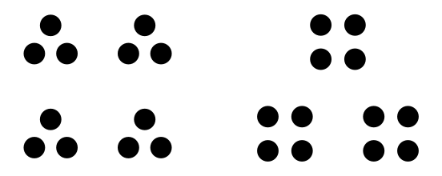
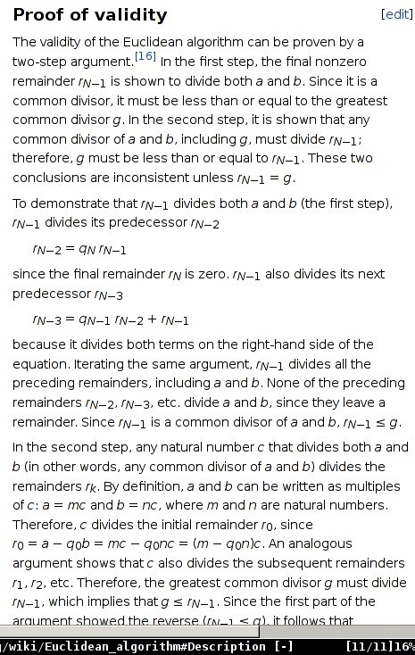

# A visualization of the euclidean algorithm

Numbers can be classified as either *composite* or *prime*. Prime numbers have no divisors other than 1 and themselves. Composite numbers, on the other hand, can be decomposed into groupings of smaller numbers. For example, one way to represent 12 is 3 times 4. We can picture this as either 4 groups of 3 or 3 groups of 4:

## The algorithm
Euclid's algorithm is an algorithm for finding the greatest common divisor of two integers. Unfortunately, it is usually presented in a (to me) baffling and unintuitive manner. It may just be because I'm not the sharpest tool in the shed, but I never grasped why the remainder had the same divisors as the starting numbers. Take a look:

    function gcd(a, b):
        // assuming a > b
        while (b does not divide a):
            r = a mod b
            a = b
            b = r
        
        return b

Here `mod` means the result of taking **a** modulo **b**, i.e. finding the remainder after dividing **a** by **b**.

So, why does it work? The standard response is that algorithm utilizes a *loop invariant*: every common divisor of **a** and **b** is also a divisor of **b** and **r**. Since the set of divisors stays constant for each iteration of the loop, and since we reduce numbers until we can't do it any more (notice that if we did it one more step, **r** would be equal to 0 since **b** divides **a** after the last step in our algorithm above.) To hammer that point home: every common divisor divides **r**, and therefore divides **b** after each step, including the **biggest** common divisor. If we stop when **b** divides **a**, then we must be stopping when **b** is the greatest common divisor (because we know, at the stopping point, that at least **b** divides **a**, so the GCD must be at least as big as **b**. But we know it can't be bigger than **b**, because the GCD also divides **b**).

That explanation may satisfy you, but you would have to 1) already understand why the set of divisors is preserved through each step through the loop, or 2) take my word for it. Since 2) isn't intellectually responsible (you don't even *know* me, and I'm just a pseudonymous internet person) and since 1) isn't likely to be true (otherwise you wouldn't be reading an article that purports to show you what you already understand), we shall have to press the issue to find out the reason why.

Rather than re-invent the wheel, let's do a brief literature review to see if someone already has a good explanation. Wikipedia, can you help us out?

Sorry, spaced out there. Where were we? Ahh yes, inspecting the uselessness of Wikipedia. I was browsing cat videos on youtube somewhere after the second paragraph.
